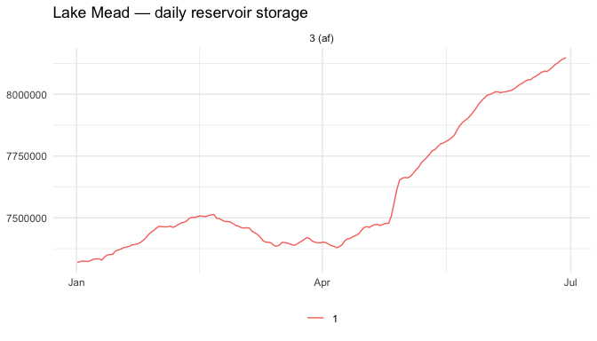

`edr4r` is a small, tidy client for
[OGC API - Environmental Data Retrieval](https://ogcapi.ogc.org/edr/)
services with JSON discovery metadata and CoverageJSON, GeoJSON, or CSV query
responses.
Most of the real-world use to date has been against in-situ monitoring
networks -- stream gauges, weather stations, snow telemetry, reservoir
telemetry -- but the package itself is generic.

Two example endpoints you can point it at right now:

- [USGS waterdata OGC API](https://api.waterdata.usgs.gov/ogcapi/beta/)
- [Western Water Datahub](https://api.wwdh.internetofwater.app)

The [Met Office Labs EDR demonstrator](https://labs.metoffice.gov.uk/edr/collections?f=html)
is another useful endpoint for cross-server experiments. It is a
**technical demonstrator, not an operational service**: its availability,
collections, and response details may change without notice, so it should not
be used as a production dependency.

This vignette uses the Western Water Datahub's `rise-edr` collection as
one real endpoint for demonstrating the core `edr4r` workflow. WWDH
dataset notes, raw HTTP walkthroughs, and presentation material live in
the standalone [WWDH EDR docs](https://ksonda.github.io/wwdh-edr-docs/).
The USGS example lives in its own article,
`vignette("usgs-streamgages")`.

## Installation

CRAN currently provides the stable `0.1.1` release:


``` r
install.packages("edr4r")
```

The upcoming `0.2.0` API is available as a GitHub-only release candidate with
[pak](https://pak.r-lib.org/):


``` r
pak::pak("ksonda/edr4r@v0.2.0-rc.1")
```

This preview has not been submitted to CRAN and intentionally reports
development version `0.1.1.9000` inside R. Use `pak::pak("ksonda/edr4r")`
instead when you want the mutable post-candidate development branch, which
currently reports `0.2.0.9000`.

## 1. Create a client


``` r
library(edr4r)
library(ggplot2)

client <- edr_client("https://api.wwdh.internetofwater.app")
client
#> <edr_client>
#>   base_url:   <https://api.wwdh.internetofwater.app>
#>   user_agent: edr4r/0.2.0.9000 (+https://github.com/ksonda/edr4r)
#>   timeout:    60s
#>   max_tries:  3
#>   retry transport failures: TRUE
#>   discovery cache: 300s
```

The client just stores connection settings (base URL, user agent,
timeout, retry policy, and an in-memory discovery cache). Pass
`verbose = TRUE` to echo every request URL, `headers =` to attach auth tokens,
or `cache_ttl =` to change the metadata lifetime.

### Try a second EDR implementation

A small terrain lookup is a low-cost way to exercise the non-operational Met
Office demonstrator without downloading forecast data:


``` r
met_client <- edr_client(
  "https://labs.metoffice.gov.uk/edr",
  timeout = 10,
  max_tries = 1
)

terrain <- edr_position(
  met_client,
  "terrain_tiles",
  coords = c(-0.1276, 51.5072),
  parameter_name = "Height"
)
covjson_to_tibble(terrain)
```

Because the endpoint is explicitly experimental, this request is not run
when the vignette is built or during `R CMD check`. The repository exercises
it separately in a scheduled, non-blocking live smoke check.

## 2. Discover collections and parameters

`edr_collections()` lists every EDR collection the service serves.


``` r
collections <- edr_collections(client)
collections[, c("id", "title", "data_queries")]
#> # A tibble: 37 × 3
#>    id                 title                                         data_queries
#>    <chr>              <chr>                                         <list>
#>  1 rise-edr           USBR Reclamation Information Sharing Environ… <chr [4]>
#>  2 snotel-edr         USDA Snowpack Telemetry Network (SNOTEL)      <chr [4]>
#>  3 awdb-forecasts-edr USDA Air and Water Database (AWDB) Forecasts  <chr [4]>
#>  4 snotel-huc06-means USDA Snotel Snow Water Equivalent Aggregated… <NULL>
#>  5 usace-edr          USACE Access2Water API                        <chr [4]>
#>  6 noaa-qpf-day-1     NOAA Weather Prediction Center Quantitative … <NULL>
#>  7 noaa-qpf-day-2     NOAA Weather Prediction Center Quantitative … <NULL>
#>  8 noaa-qpf-day-3     NOAA Weather Prediction Center Quantitative … <NULL>
#>  9 noaa-qpf-day-4-5   NOAA Weather Prediction Center Quantitative … <NULL>
#> 10 noaa-qpf-day-6-7   NOAA Weather Prediction Center Quantitative … <NULL>
#> # ℹ 27 more rows
```

The `data_queries` column tells you which EDR query types each
collection supports (`locations`, `cube`, `area`, ...). Hit a verb
the server doesn't implement and you get an HTTP error.

For a new endpoint, inspect the richer capability metadata or run safe,
metadata-only diagnostics before choosing a query:


``` r
caps <- edr_capabilities(client, "rise-edr")
caps$queries

edr_supports(client, "rise-edr", query = "cube")
edr_diagnose(client, "rise-edr")
```

Landing, conformance, collection, instance, and queryables metadata is cached
inside the client for a bounded period. Pass `refresh = TRUE` to a discovery
call when you need a fresh server response, or call
`edr_cache_clear(client)`.

To see the data parameters a collection exposes (the values you can
pass to `parameter_name =` on the query verbs), use
`edr_parameters()`:


``` r
params <- edr_parameters(client, "rise-edr")
nrow(params)
#> [1] 782
head(params[, c("id", "name", "unit_symbol")])
#> # A tibble: 6 × 3
#>   id    name                                             unit_symbol
#>   <chr> <chr>                                            <chr>
#> 1 1835  Secondary Canal Stage                            ft
#> 2 1834  Lake/Reservoir Elevation                         ft
#> 3 1830  Lake/Reservoir Release - Total                   cfs
#> 4 1818  Total Dissolved Gas (TDG)                        %
#> 5 1817  Growing Degree Days (50 Degree Base Temperature) GDD
#> 6 1816  Calculated Unregulated Flow                      taf
```

`edr_queryables()` is something different -- it returns the OGC
queryables JSON Schema (filter properties for CQL2 / OGC API
Features). For discovering parameter names, `edr_parameters()` is what
you want.


``` r
# Pick out the daily reservoir storage parameter (id "3"):
params[params$id == "3", c("id", "name", "unit_symbol", "unit_label")]
#> # A tibble: 1 × 4
#>   id    name                              unit_symbol unit_label
#>   <chr> <chr>                             <chr>       <chr>
#> 1 3     Daily Lake/Reservoir Storage (af) acre·ft     Acre Foot
```

## 3. Find locations

`edr_locations()` returns one station-index response as a GeoJSON
`FeatureCollection`, promoted to an `sf` object when
[`sf`](https://r-spatial.github.io/sf/) is installed. WWDH currently returns
its full locations index in that response. On servers that advertise a
`rel = "next"` link, set `paginate = TRUE` together with finite
`max_pages` and `max_features` caps.


``` r
stations <- edr_locations(client, "rise-edr")
nrow(stations)
#> [1] 926
head(stations[, c("_id", "locationName")])
#> Simple feature collection with 6 features and 2 fields
#> Geometry type: POINT
#> Dimension:     XY
#> Bounding box:  xmin: -122.474 ymin: 32.8834 xmax: -101.2656 ymax: 48.2667
#> Geodetic CRS:  WGS 84
#> # A tibble: 6 × 3
#>   `_id` locationName                                      geometry
#>   <int> <chr>                                          <POINT [°]>
#> 1     1 Marys Lake                            (-105.5343 40.34408)
#> 2     2 Audubon Lake North Dakota              (-101.2656 47.6114)
#> 3     3 Gray Reef Reservoir and Dam            (-106.6989 42.5656)
#> 4     5 Lake Frances Reservoir                    (-112.2 48.2667)
#> 5     6 Spring Creek Reservoir and Debris Dam    (-122.474 40.629)
#> 6     7 Imperial Reservoir at Imperial Dam     (-114.4676 32.8834)
```

The WWDH `rise-edr` locations index uses `_id` as the identifier
column, not `id`. That's fine -- the query verbs accept either, and
`edr_map()` will auto-detect.

## 4. Retrieve data for one station

Pick a known station (Lake Mead, `_id` 3514) and a parameter (`3`,
Daily Reservoir Storage) and you get CoverageJSON back. Flatten it
with `covjson_to_tibble()`:


``` r
resp <- edr_location(
  client, "rise-edr",
  location_id    = 3514,
  datetime       = "2023-01-01/2023-06-30",
  parameter_name = "3"
)

df <- covjson_to_tibble(resp)
head(df)
#> # A tibble: 6 × 9
#>   coverage_id parameter parameter_label    unit  datetime                x     y
#>   <chr>       <chr>     <chr>              <chr> <dttm>              <dbl> <dbl>
#> 1 1           3         Lake/Reservoir St… af    2023-01-01 07:00:00 -115.  36.0
#> 2 1           3         Lake/Reservoir St… af    2023-01-02 07:00:00 -115.  36.0
#> 3 1           3         Lake/Reservoir St… af    2023-01-03 07:00:00 -115.  36.0
#> 4 1           3         Lake/Reservoir St… af    2023-01-04 07:00:00 -115.  36.0
#> 5 1           3         Lake/Reservoir St… af    2023-01-05 07:00:00 -115.  36.0
#> 6 1           3         Lake/Reservoir St… af    2023-01-06 07:00:00 -115.  36.0
#> # ℹ 2 more variables: z <dbl>, value <dbl>
```

### Retrieve several explicit stations

For an endpoint without a spatial bulk verb, or when you have already chosen
specific stations, `edr_location_batch()` provides a finite sequential loop
with visible provenance and failures:


``` r
selected_ids <- as.character(stations$`_id`[1:5])
batch <- edr_location_batch(
  client, "rise-edr",
  location_id    = selected_ids,
  datetime       = "2023-01-01/2023-06-30",
  parameter_name = "3",
  chunk           = "1 month",
  checkpoint      = "wwdh-monthly-checkpoint",
  resume          = TRUE,
  max_requests   = 30,
  on_error       = "collect",
  progress       = FALSE
)

batch$requests
batch$data
batch$errors
```

The request count and every location ID are validated before the first HTTP
call. Here the complete plan is five stations by six monthly windows. Adjacent
closed windows may repeat a boundary observation; the combined data keeps the
earliest exact copy while `batch$requests` retains each raw row count. In this
example, the first call initializes the checkpoint and later identical calls
reuse successful or empty windows while retrying unresolved ones. The
checkpoint contains parsed observations and can be removed when the pull is no
longer needed. In this WWDH workflow, `cube` remains preferable when all
stations in a spatial extent are wanted in one request.

## 5. Plot the time series

`edr_plot()` is a small `ggplot2` wrapper for the tidy tibble:


``` r
edr_plot(resp) +
  ggtitle("Lake Mead — daily reservoir storage")
```

<div class="figure">

<p class="caption">plot of chunk plot-lake-mead</p>
</div>

Faceted by parameter (so different units don't share a y-axis) and
coloured by station. Add layers or themes like any other ggplot.

## 6. Map stations with per-station popups

For collections that support `cube`, `edr_explore()` fetches every
station's data in **one** bulk request and renders the map with
per-station popups -- much faster than fetching one station at a
time. `rise-edr` advertises `cube`, so the default `method = "auto"`
takes that path.


``` r
m <- edr_explore(
  client, "rise-edr",
  bbox           = c(-114, 32, -111, 38),         # SW US
  datetime       = "2023-01-01/2023-06-30",
  parameter_name = "3",
  popup          = "plot+csv",
  label_col      = "locationName",
  quiet          = TRUE
)
```

```{r include-full-station-map, echo=FALSE, results='asis'}
if (Sys.getenv("EDR4R_FULL_VIGNETTES") == "true") {
  station_map <- "getting-started-full/station-map-iframe.html"
  if (!file.exists(station_map)) {
    stop("Full station map output is missing: ", station_map)
  }
  cat(readLines(station_map, warn = FALSE), sep = "\n")
}
```

The object prints as an interactive leaflet map in an R session;
each blue marker opens the larger plot/CSV popup for the station.

Markers with data are blue (clickable popup with plot + CSV);
stations the bbox covers that returned no data for the requested
parameter/window are dimmed grey. A legend in the bottom-right
explains the distinction.

Save the same map to standalone HTML (selfcontained, no sidecar
directory):


``` r
edr_save_html(m, "reservoir-southwest.html")
```

## A few things worth knowing

- `datetime` is forgiving: pass `"start/end"`, an open interval like
  `"2020-01-01/.."`, or a length-2 character vector. It gets
  normalised into the ISO-8601 form the server expects.
- `parameter_name` is a character vector. It's sent as one
  comma-separated `parameter-name` query parameter.
- Some monitoring networks use compound station IDs (colon-separated
  triplets like `"1185:CO:SNTL"` show up in snow and forecast
  networks). Those work as-is -- reserved characters get URL-encoded
  for you. A literal `/` in an ID is rejected, because it can't
  survive a round trip through HTTP path segments no matter how you
  encode it.
- Not every server implements every EDR verb. `locations`, `position`,
  `cube`, and `area` are common; `radius`, `trajectory`, and
  `corridor` less so. The client supports them all per the
  [spec](https://ogcapi.ogc.org/edr/), but a call against a collection
  that doesn't implement a given verb returns an HTTP error.

## See also

- `vignette("cross-endpoint-water-context")` -- combine a Met Office
  population grid, USGS river discharge, and WWDH reservoir storage in one
  bounded Lake Mead study area.
- `vignette("compatibility")` -- the supported EDR/encoding subset, verified
  endpoint matrix, and known limitations.
- `vignette("usgs-streamgages")` -- a walk-through against the USGS
  waterdata endpoint, which only advertises `locations` (so the
  per-station fallback kicks in).
- [Standalone WWDH EDR docs](https://ksonda.github.io/wwdh-edr-docs/)
  -- WWDH-specific dataset notes, raw HTTP examples, and presentation
  material.
