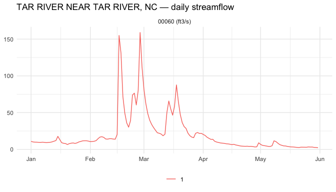

The [USGS waterdata OGC API](https://api.waterdata.usgs.gov/ogcapi/beta/)
is a clean, real-world EDR endpoint with one collection (`daily-edr`)
that exposes every USGS station's daily-value time series. It's a good
target for learning `edr4r` because the API surface is small and the
data is familiar (stream gauges).

This vignette walks through a typical streamgage exploration: discover what's
on offer, follow every advertised location page inside a small northern North
Carolina Piedmont study area, pull recent streamflow for each station, and
render an interactive map. The displayed results were precomputed from the
live USGS endpoint so package checks remain offline.

## 1. Connect and discover collections


``` r
library(edr4r)
library(ggplot2)

usgs <- edr_client("https://api.waterdata.usgs.gov/ogcapi/beta")
edr_collections(usgs)[, c("id", "title", "data_queries")]
#> # A tibble: 1 × 3
#>   id        title                                           data_queries
#>   <chr>     <chr>                                           <list>      
#> 1 daily-edr Daily values environmental data retrieval (EDR) <chr [1]>
```

USGS exposes a single collection, `daily-edr`. The `data_queries`
column tells us what query verbs it supports:


``` r
edr_collections(usgs)$data_queries[[1]]
#> [1] "locations"
```

Just `locations`. No `cube`, no `area`, no `position`. That matters:
`edr_explore()` will fall back to per-station fetches instead of one
bulk call. For a handful of gauges that's fine; for thousands it would be slow.
The WWDH `rise-edr` collection in `vignette("getting-started")` shows
the bulk-fetch path against a richer server.

### Discovering parameters

`edr_parameters()` reads the `parameter_names` block from the
collection document -- but USGS doesn't populate it. Use
`edr_queryables()` instead to see what filter properties the server
exposes:


``` r
q <- edr_queryables(usgs, "daily-edr")
names(q$properties)
#>  [1] "geometry"                      "id"                           
#>  [3] "unit_of_measure"               "parameter_name"               
#>  [5] "parameter_code"                "statistic_id"                 
#>  [7] "hydrologic_unit_code"          "state_name"                   
#>  [9] "last_modified"                 "begin"                        
#> [11] "end"                           "computation_period_identifier"
#> [13] "computation_identifier"        "thresholds"                   
#> [15] "sublocation_identifier"        "primary"                      
#> [17] "monitoring_location_id"        "web_description"              
#> [19] "parameter_description"         "parent_time_series_id"
```

`parameter_code` is the filter you'd pass as `parameter_name =` in a
query. USGS uses the standard
[NWIS parameter codes](https://waterdata.usgs.gov/code-dictionary)
-- a few common ones for streamgages:

| Code    | Meaning                              | Unit   |
|---------|--------------------------------------|--------|
| `00060` | Discharge (streamflow)               | ft³/s  |
| `00065` | Gage height (stage)                  | ft     |
| `00010` | Water temperature                    | °C     |
| `00400` | pH                                   | std units |
| `00095` | Specific conductance                 | µS/cm  |

The rest of this vignette uses `00060` -- daily mean streamflow.

## 2. Find streamgages in a bounded study area

A compact box around several Tar River tributaries keeps this example small
while still forcing more than one server page:


``` r
piedmont_bbox <- c(-78.60, 36.04, -78.28, 36.22)
#                    minx   miny    maxx   maxy
```

USGS paginates its location index with an opaque cursor. Opt into bounded
pagination to make "every gauge" explicit; `limit` is the page size, while
the two client-side caps guard the total pull. With
[`sf`](https://r-spatial.github.io/sf/) installed the combined response is an
`sf` object with one point per gauge:


``` r
gauges <- edr_locations(
  usgs, "daily-edr",
  bbox = piedmont_bbox,
  limit = 2,
  paginate = TRUE,
  max_pages = 10,
  max_features = 20
)
nrow(gauges)
#> [1] 5

gauges[, c("id", "monitoring_location_name", "county_name", "drainage_area")]
#> Simple feature collection with 5 features and 4 fields
#> Geometry type: POINT
#> Dimension:     XY
#> Bounding box:  xmin: -78.58306 ymin: 36.05404 xmax: -78.29611 ymax: 36.2132
#> Geodetic CRS:  WGS 84
#> # A tibble: 5 × 5
#>    id              monitoring_location_name            county_name drainage_area
#>    <chr>           <chr>                               <chr>               <dbl>
#>  1 USGS-02081500   TAR RIVER NEAR TAR RIVER, NC        Granville …        167   
#>  2 USGS-02081740   TAR RIVER AT LOUISBURG, NC          Franklin C…        429   
#>  3 USGS-02081747   TAR R AT US 401 AT LOUISBURG, NC    Franklin C…        427   
#>  4 USGS-02081800   CEDAR CREEK NEAR LOUISBURG, NC      Franklin C…         47.8 
#>  5 USGS-0208273070 DEVILS CRADLE C AT NC 39 NR KEARNE… Franklin C…          2.89
#> # ℹ 1 more variable: geometry <POINT [°]>
```

Each `gauges$id` is in the form `"USGS-02087500"` (agency code + the
familiar 8-digit NWIS site number). That's what you pass back as
`location_id =` to a query.

## 3. Pull streamflow for one station

A USGS quirk to flag up front: when you ask for a specific station
with `edr_location()`, the server **ignores the `datetime` interval
and just returns the most recent `limit` records** (`limit` defaults
to 10). To get five months of daily data, pass a `limit` that
comfortably covers the window -- say 200 days -- and filter to the
target window client-side.


``` r
example_id   <- gauges$id[[1]]
example_name <- gauges$monitoring_location_name[[1]]

resp <- edr_location(
  usgs, "daily-edr",
  location_id    = example_id,
  parameter_name = "00060",
  limit          = 200
)
df <- covjson_to_tibble(resp)

# Filter to the Jan–May 2026 window we care about
df_jan_may <- df[df$datetime >= as.POSIXct("2026-01-01", tz = "UTC") &
                 df$datetime <= as.POSIXct("2026-05-31", tz = "UTC"), ]
head(df_jan_may[, c("datetime", "value", "unit")])
#> # A tibble: 6 × 3
#>   datetime            value unit 
#>   <dttm>              <dbl> <chr>
#> 1 2026-05-31 00:00:00  2.21 ft3/s
#> 2 2026-05-30 00:00:00  2.53 ft3/s
#> 3 2026-05-29 00:00:00  2.66 ft3/s
#> 4 2026-05-28 00:00:00  3.14 ft3/s
#> 5 2026-05-27 00:00:00  3.13 ft3/s
#> 6 2026-05-26 00:00:00  3.29 ft3/s
```

`edr_plot()` is a small ggplot wrapper for the tidy tibble:


``` r
edr_plot(df_jan_may) +
  ggtitle(paste0(example_name, " — daily streamflow"))
```

<div class="figure">

<p class="caption">plot of chunk plot-one-gauge</p>
</div>

If you already know the station IDs, the public batch helper performs the same
bounded per-station workflow without discovering or parallelizing anything:


``` r
all_streamflow <- edr_location_batch(
  usgs, "daily-edr",
  location_id    = gauges$id,
  parameter_name = "00060",
  limit           = 200,
  max_requests    = nrow(gauges),
  on_error        = "collect",
  progress        = FALSE
)

all_streamflow$requests
all_streamflow$data
all_streamflow$errors
```

## 4. Map every gauge with per-station popups

`edr_explore()` does the per-station loop and hands the results to
`edr_map()` in one call. Each marker becomes an inline plot + CSV
download for that gauge.


``` r
m <- edr_explore(
  usgs, "daily-edr",
  bbox           = piedmont_bbox,
  parameter_name = "00060",
  record_limit   = 200,                 # ~6 months of daily values per station
  popup          = "plot+csv",
  label_col      = "monitoring_location_name",
  quiet          = TRUE
)
```


Print `m` in an interactive R session to open the map. Click any blue marker
to open the popup; its Jan–May 2026 streamflow plot is inline, and the
"Download CSV" link delivers that gauge's series.

To write the same map to a standalone HTML file, use `edr_save_html()`:


``` r
edr_save_html(m, "piedmont-streamgages.html")
```

## A few things worth knowing about the USGS endpoint

- `daily-edr` only advertises the `locations` query. The other EDR
  verbs (`cube`, `area`, `position`, ...) return HTTP errors. The
  per-station fallback works fine for tens of gauges; for hundreds
  consider pre-filtering aggressively with `bbox =`.
- `datetime` is **not honoured** on `/locations/{id}` requests -- the
  server returns the latest `limit` records regardless. Pass enough
  `limit` to cover your window, then filter client-side.
- The station id format is `"USGS-<NWIS-id>"`. The bare NWIS id
  (`"02087500"`) doesn't work; pass the full `"USGS-..."` form, which
  is what `edr_locations()` returns in its `id` column.
- The 44-column attribute table on `gauges` carries a lot of useful
  metadata (`drainage_area`, `state_name`, `hydrologic_unit_code`,
  `altitude`, ...). Use it to filter or label before mapping.
- Pass `label_col = "monitoring_location_name"` to `edr_map()` so
  popup titles read "BUFFALO CREEK NEAR FALLS, NC" instead of the
  raw `USGS-02087183` id.

## See also

- `vignette("cross-endpoint-water-context")` -- place a USGS Hoover Dam
  discharge series beside WWDH Lake Mead storage and a Met Office population
  grid.
- `vignette("getting-started")` -- same workflow against the Western
  Water Datahub, which advertises `cube` for fast bulk fetches.
- The
  [USGS NWIS parameter code dictionary](https://waterdata.usgs.gov/code-dictionary)
  for picking the right `parameter_code`.
